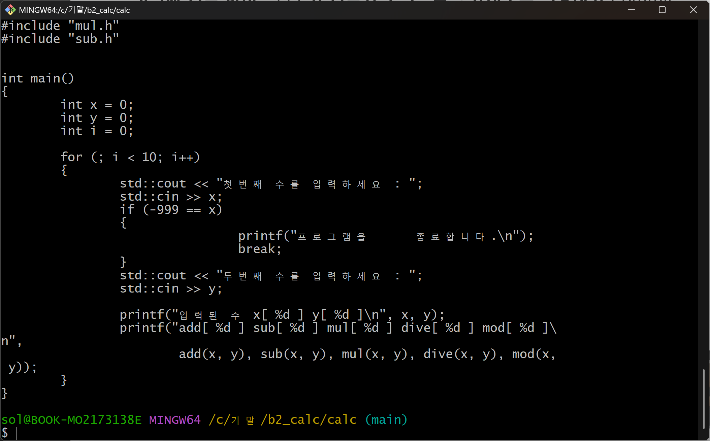
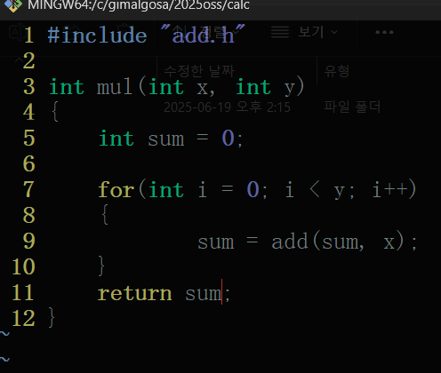
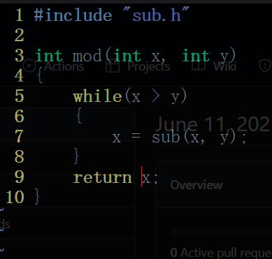
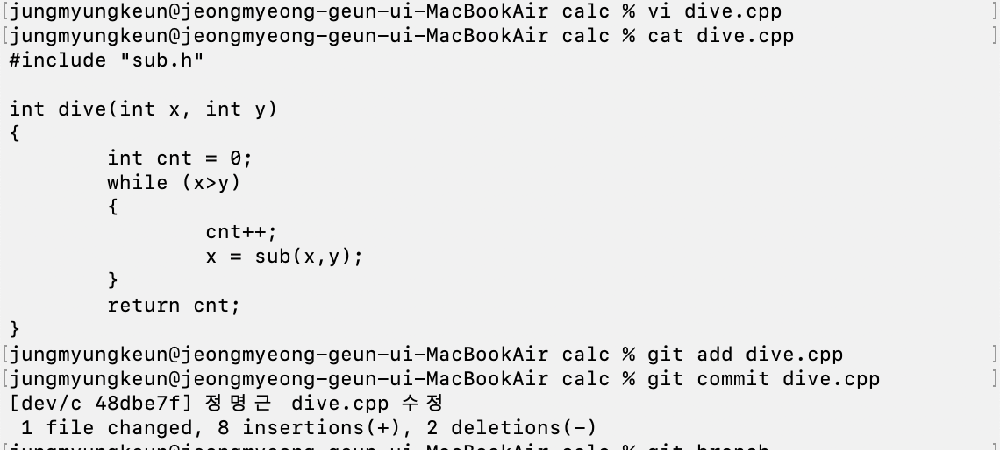
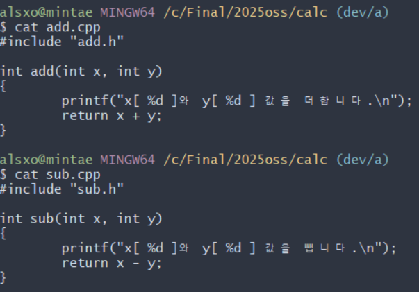
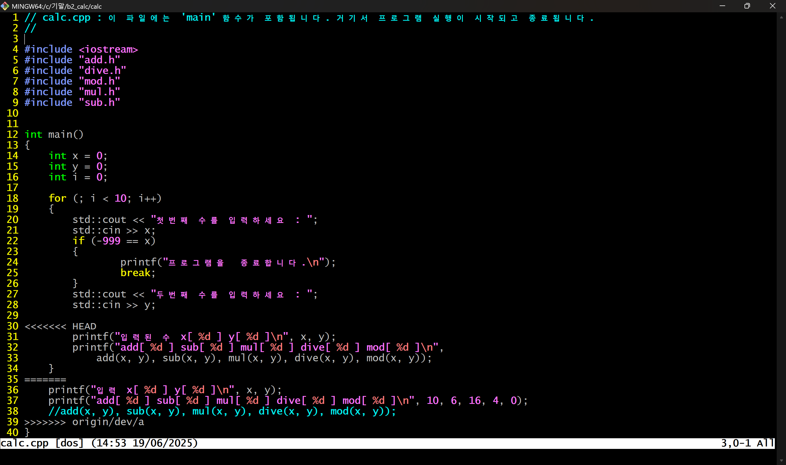
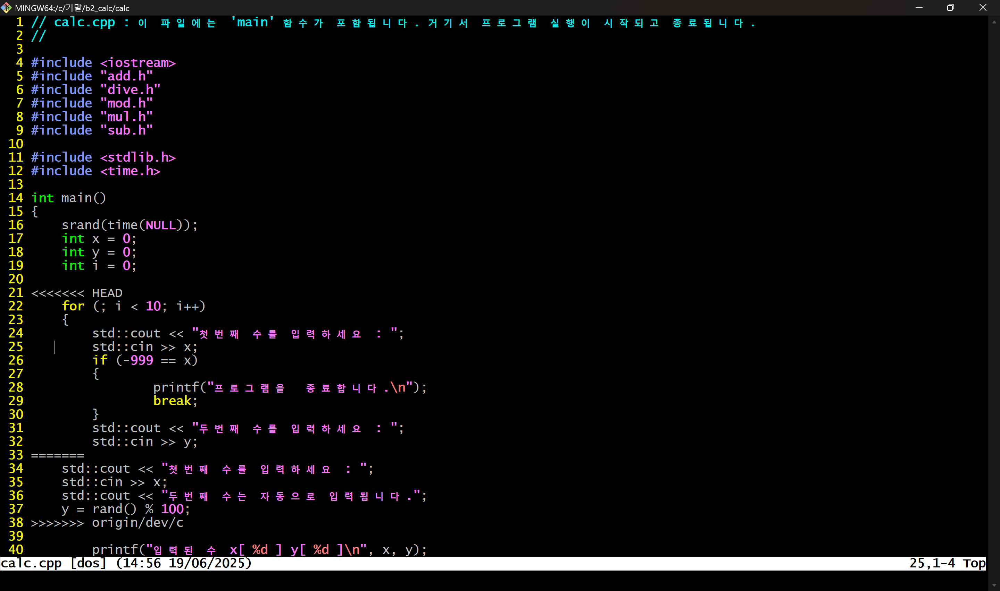
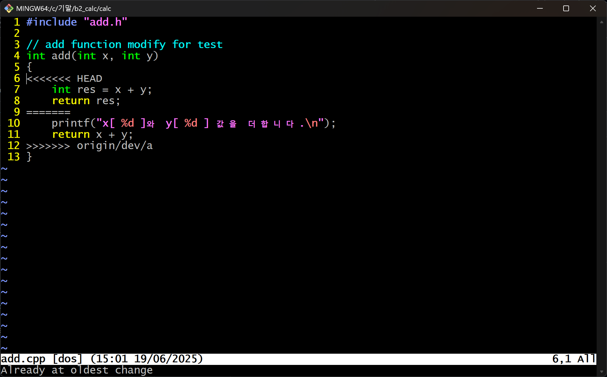
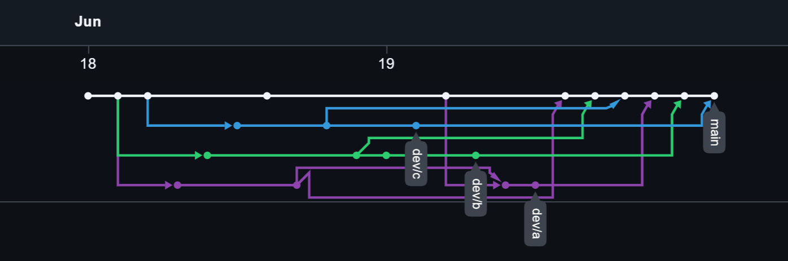
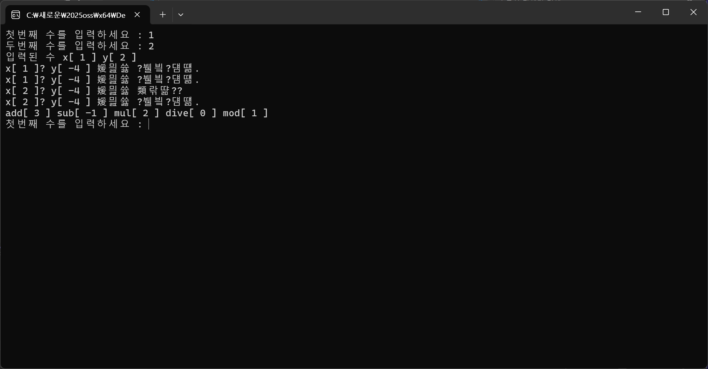

# calc

## oss 기말 프로젝트

저장소 : https://github.com/202407001/2025oss

---

| 팀원(역할)           |업무                                   |
|----------------------|----------------------------------------|
| 이한솔(팀장 - 202207066) | main 브랜치 수정         |
| 정민석(팀원 - 202207044) | dev/b 브랜치 수정    |
| 정명근(팀원 - 202207042) | dev/c 브랜치 , README.md 파일 수정    |
 이민태(팀원 - 202207045) | dev/a 브랜치 수정    

---

## 문제해결 방법과 순서

- dev/a add.h / sub.h 해결과정
1. modified 상태에 있던 
add.h/sub.h 유니코드 오류 삭제
2. calc.cpp의 충돌 해결

- merge 중 충돌 해결
1. main 과 dev/a 의 calc.cpp 파일 충돌
2. main 과 dev/c 의 calc.cpp 파일 충돌
3. main 과 dev/a 의 add.cpp 파일 충돌

---
## 중간과정 스크린 샷

1. 팀원들의 각자 브렌치에서 파일 수정

 - 202207066 이한솔
 - main.cpp 수정

---

- 202207042 정민석
- mul.cpp 수정

- mod.cpp 수정

---
- 202207042 정명근
- dive.cpp 수정

---

- 202207045 이민태
- add.cpp / sub.cpp 수정

-----
## 충돌 해결 과정

- dev/a add.h / sub.h 해결과정
1. modified 상태에 있던 
add.h/sub.h 유니코드 오류 삭제

2. calc.cpp의 충돌 해결

- merge 중 충돌 해결
1. main 과 dev/a 의 calc.cpp 파일 충돌

2. main 과 dev/c 의 calc.cpp 파일 충돌

3. main 과 dev/a 의 add.cpp 파일 충돌

---
## git flow 스크린샷

---
## 결과

